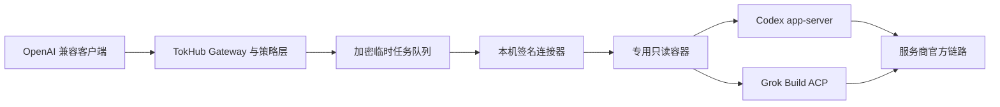

# TokHub

[](https://github.com/yaojingang/TokHub/releases)
[](https://github.com/yaojingang/TokHub/actions/workflows/ci.yml)
[](LICENSE)

TokHub 是面向 AI API 服务的开源监控、推荐运营和 OpenAI 兼容网关。它把公开状态页、供应商排行、用户工作区、个人 AI 账号连接、专属中转、分层探测、用量计量、告警审计和自托管部署放在一个系统里。

English: [README.en.md](docs/README.en.md)

当前版本：`v2.0.0-rc.2`，[查看发布说明](https://github.com/yaojingang/TokHub/releases/tag/v2.0.0-rc.2)

TokHub 2.0 RC2 为普通用户提供三层清晰的 AI 连接能力：官方开发者 API、官方账号本地连接、本机实验室。ChatGPT 使用官方 Codex `app-server`，Grok 使用官方 Grok Build ACP；两者运行在用户设备的专用只读容器中。Gemini 保留 API Key 与 Google Cloud OAuth，DeepSeek 的生产入口只接受官方 API Key。

> OpenCLI、DeepSeek 网页 Session、旧 ChatGPT Codex OAuth 已转入本机实验室。实验连接无法生成生产 Gateway Key。升级迁移会停用旧连接、擦除消费者 Token 密文并禁用对应托管通道。

## 快速导航

- [TokHub 2.0 RC2 的变化](#tokhub-20-rc2-的变化)
- [三层 AI 服务连接](#三层-ai-服务连接)
- [官方客户端连接器](#官方客户端连接器)
- [服务商支持矩阵](#服务商支持矩阵)
- [普通用户使用流程](#普通用户使用流程)
- [应用场景](#应用场景)
- [核心能力](#核心能力)
- [快速启动](#快速启动)
- [生产部署](#生产部署)
- [API](#api)

## TokHub 2.0 RC2 的变化

| 维度 | RC1 | RC2 |
| --- | --- | --- |
| 个人账号链路 | 消费者 OAuth、网页 Session、OpenCLI 实验反代 | ChatGPT Codex 与 Grok Build 官方客户端本地委托 |
| 生产策略 | 多种实验连接可进入个人中转 | 生产只允许 API Key、Gemini OAuth、ChatGPT/Grok 官方客户端 |
| 本机隔离 | 浏览器与连接器共享用户环境 | 专用非 root 只读容器，只挂载命名卷，不挂载用户目录 |
| 设备信任 | 设备令牌与任务租约 | Ed25519 请求签名、60 秒时间窗、Nonce 防重放、HTTPS |
| 数据边界 | 实验任务临时传递输入与结果 | Prompt 与结果只进入加密 Redis 临时载荷，数据库只存元数据 |
| 多轮能力 | 调用方重复提交完整消息 | `/v1/responses` 使用 `previous_response_id` 恢复官方客户端会话 |
| 账号保护 | 低频、单并发和错误冷却 | 单设备、单连接、15 秒间隔、20 次/小时、80 次/日、零重试 |
| 风险处置 | 实验适配器各自处理 | 统一处理 401、403、安全挑战、429、超时、身份变化与工具事件 |
| 策略治理 | 功能开关 | 代码内置 Provider Policy、90 天复核、条款摘要与 Kill Switch |



## 三层 AI 服务连接

| 层级 | TokHub 保存 | 支持范围 | 生产 Gateway | 适用场景 |
| --- | --- | --- | --- | --- |
| 官方 API | 加密 API Key 或 Gemini OAuth bundle | OpenAI、Gemini、Kimi、DeepSeek、豆包、Claude、千问、Grok | 支持 | 生产应用、团队配额、稳定自动化 |
| 官方账号本地连接 | 加密设备引用、账号指纹、风险状态 | ChatGPT Codex、Grok Build | 支持，固定个人范围 | 个人会员账号的低频纯文本调用 |
| 本机实验室 | 设备引用与实验状态 | OpenCLI、DeepSeek 网页 Session、旧 Codex OAuth | 禁止 | 协议研究、适配验证、自托管实验 |

Provider Policy 会在连接目录、新建连接、快速中转和网关执行四层校验。官方客户端策略复核到期、运维上报的条款摘要与内置摘要不一致、或服务商 Kill Switch 开启时，新任务立即停止；同一平台的官方 API Key 路径继续服务。

## 官方客户端连接器

`tokhub-client-connector` 提供 `doctor`、`pair`、`login`、`run`、`logout` 和 `sessions clean`。配对码 10 分钟有效，首次配对在容器内生成 Ed25519 密钥。每个请求签名覆盖方法、路径、Body Hash、时间戳和随机 Nonce。

连接器接口要求 HTTPS。TokHub 直接终止 TLS 时无需额外配置；TLS 由反向代理终止时，使用 `TOKHUB_AI_OFFICIAL_CLIENT_TRUSTED_PROXY_CIDRS` 明确填写代理网段。未受信代理发送的 `X-Forwarded-Proto` 会被拒绝，开发环境的明文 HTTP 同时要求请求主机与网络对端均为 loopback。

镜像固定安装 `@openai/codex@0.148.0` 与官方 Grok Build `1.0.5` 二进制，并校验锁文件或 SHA256。Grok Build 当前官方分发没有可验证的 `@xai-official/grok@0.1.4` npm 包，RC2 使用 xAI 官方发布渠道中的固定版本。

```bash
docker build -t tokhub-client-connector:2.0.0-rc.2 \
  -f deploy/official-client-connector/Dockerfile .

cd deploy/official-client-connector
docker compose run --rm connector pair --server https://tokhub.example.com --code <pairing-code>
docker compose run --rm connector login chatgpt
docker compose run --rm connector login grok
docker compose up -d connector
```

容器安全边界：

- 只读根文件系统、非 root 用户、无特权、删除全部 Linux capabilities。
- 只挂载 Connector、Codex、Grok 三个命名卷，不挂载 `$HOME`、浏览器目录或项目目录。
- Codex 使用空工作目录、只读 sandbox、`approval_policy=never`，关闭网络搜索、应用、浏览器、Shell 和统一执行能力。
- Grok 使用 root 拥有的 requirements policy 拒绝全部工具，关闭 MCP、Subagent、Memory、Web Search、自动更新、遥测和反馈。
- 发现工具调用、文件操作或命令事件时立即中断任务，并把连接置为 `policy_locked`。
- 调用方断开连接后，TokHub 取消任务租约，连接器随即终止当前官方客户端进程。

官方客户端个人中转固定别名为 `chatgpt-personal` 和 `grok-personal`。`/v1/responses` 支持文本流式、非流式和多轮恢复；图片、音频、工具、函数调用与 Anthropic Messages 返回 `422 unsupported_capability`。Response ID 绑定用户、Gateway Key、连接和模型，空闲 24 小时或创建 7 天后失效。上游会话 ID 先由配对设备密封，再进入 TokHub 加密存储；其他设备无法打开该引用。

## 服务商支持矩阵

| 服务商 | 官方 API Key | 生产账号连接 | 本机实验室 | 生产说明 |
| --- | --- | --- | --- | --- |
| ChatGPT / OpenAI | 支持 | Codex `app-server` | OpenCLI、旧 Codex OAuth | 官方客户端仅个人、纯文本、单并发 |
| Gemini | 支持 | Google Cloud OAuth | OpenCLI | OAuth 需要 Cloud Project 与 HTTPS 回调 |
| Kimi | 支持 | 暂无 | 暂无 | 支持中国大陆和国际 Endpoint |
| DeepSeek | 支持 | 暂无 | OpenCLI、网页 Session | 生产页只展示官方 API Key，DS2API 仅 `lab` profile |
| 豆包 | 支持 | 暂无 | 暂无 | 使用火山方舟 API Key |
| Claude | 支持 | 暂无 | 暂无 | 使用 Anthropic API Key |
| 千问 | 支持 | 暂无 | 暂无 | 支持多地域与 Workspace Endpoint |
| Grok | 支持 | Grok Build ACP | 暂无 | 官方客户端优先使用稳定账号主体，缺失时采用设备级身份 |

## 普通用户使用流程

1. 登录 TokHub，进入“个人空间 > AI 服务连接”。
2. 在“官方 API”“官方账号本地连接”“本机实验室”中选择入口。
3. ChatGPT 或 Grok 用户先创建本机连接器，复制 10 分钟一次性配对命令。
4. 在专用容器中执行 Device Auth，启动连接器并等待账号与模型检查通过。
5. 创建官方客户端连接；TokHub 绑定账号指纹、设备、公有模型别名和风险窗口。
6. 创建个人中转与 Gateway Key，把 Base URL 设置为 `https://<your-domain>/gateway/v1`。
7. 首轮 Responses 请求返回 `resp_*`；后续请求使用 `previous_response_id` 延续会话。
8. 401 后重新登录并验证原账号，再由用户手动恢复；安全挑战、身份变化或工具事件需要管理员检查。

## 应用场景

| 场景 | 推荐组合 | 边界 |
| --- | --- | --- |
| 个人会员账号中转 | ChatGPT Codex 或 Grok Build 官方客户端、个人 Gateway Key | 单设备、单连接、单并发、固定日限额 |
| 个人开发者中转 | 官方 API Key、个人中转、独立 Gateway Key | 支持稳定自动化与密钥轮换 |
| Google Cloud 个人项目 | Gemini OAuth、自动刷新、账号一致性检查 | 需要用户自己的 Cloud Project |
| 室友或小团队共享 | 官方开发者 API、工作区成员、成员 Gateway Key | 官方客户端连接固定为连接持有人本人 |
| 多上游容灾网关 | 私有通道、分层探测、路由和熔断 | 使用服务商开发者 API |
| 协议研究实验室 | OpenCLI、DeepSeek Session、独立 lab profile | 无生产 Gateway Key，部署方承担实验风险 |

官方客户端委托可以减少消费者 Cookie 与 Session 的集中保存，并通过低频、零重试、身份锁定和工具封禁降低自动化暴露面。服务商仍可依据条款、套餐、异常行为或安全策略限制账号，TokHub 不承诺零封号风险。

## 核心能力

### 公开监控和推荐前台

- 公开首页、通道列表、通道详情、供应商排行和精选推荐。
- 支持按品牌、模型、状态、价格、延迟、成功率等维度组织展示。
- 前台推荐页由后台配置驱动，支持精选位、新人福利、场景推荐和多套榜单规则。
- 提供 `/api/public/*` 公开数据接口和 `/v1/status/*` 第三方只读 Open API。
- 支持生成独立通道站点资产，便于把公开监控和推荐能力拆给不同站点使用。

### 用户工作区

- 用户可以收藏公开通道，也可以创建自己的私有通道。
- 私有通道支持 Endpoint、模型、额度、状态、立即探测和连接测试。
- 用户工作区包含专属网关、Gateway Key、成员、用量、告警、事件和审计。
- 工作区数据按组织隔离，普通用户不能访问平台后台和其它工作区资源。

### 个人 AI 账号和专属中转

- 八家服务商统一使用 Provider Manifest，集中管理地域、Endpoint、协议、模型和验证方式。
- API Key、OAuth 和官方客户端连接按各自协议完成真实可用性与身份验证。
- OAuth 凭据支持后台刷新、退避、失效检测、账号一致性检查、重新授权、撤销和审计。
- ChatGPT Codex 与 Grok Build 官方客户端连接执行个人范围、单连接、单并发、固定频率和风险熔断。
- 本机实验室连接与生产 Gateway 隔离，旧消费者凭据在安全迁移中被擦除。
- 连接验证通过后可以创建个人 OpenAI 兼容中转，并使用独立 Gateway Key。

### 平台管理后台

- 管理平台通道、私有通道、用户、组织、成员、Gateway Key、Open API 站点和推荐运营配置。
- 支持通道 CSV 导入导出、通道同步、批量启停、批量删除和二次密码验证。
- 支持全局用量报表、请求事件、成本估算、审计导出和治理概览。
- 支持站点配置、前台文案、模型目录和价格配置的后台维护。

### OpenAI 兼容专属网关

- 对外暴露 `/gateway/v1/*`，兼容 OpenAI 风格的 Models、Chat Completions 和 Responses 调用。
- 每个网关可以绑定多个平台上游或用户私有上游。
- Gateway Key 支持 QPS、月配额、状态管理、撤销、删除和一次性明文展示。
- 兼容非流式和流式响应，记录请求模型、上游通道、状态码、Token、延迟、成本和错误类型。

## 探测和健康算法

TokHub 把通道健康拆成三层，不把“接口能连上”和“模型真的能生成”混为一谈。

### L1 连通性探测

L1 负责基础网络链路：

- 解析 Endpoint URL。
- DNS 解析目标主机。
- 建立 TCP 连接。
- 对 HTTPS 目标执行 TLS 握手，并记录证书过期时间。
- 发起 HTTP HEAD 请求，判断入口是否可达。

L1 能定位 `dns_failed`、`tcp_failed`、`tls_failed`、`http` 层错误和坏 Endpoint。

### L2 模型可用性探测

L2 调用上游 `/models`，验证：

- API Key 是否有效。
- 上游是否返回可解析的模型列表。
- 当前配置的模型是否存在或可用。
- 部分供应商可按 provider profile 跳过模型列表探测。

L2 会把 401、403 识别为 `auth_error`，把模型缺失识别为 `model_not_found`。

### L3 真实生成探测

L3 发起最小 Chat Completions 请求，提示词要求模型只返回固定内容，用来验证真实推理链路：

- 记录总延迟、首 Token 估算、HTTP 状态、Token 用量和成本。
- 校验生成内容是否符合预期，避免“HTTP 成功但模型没有正常生成”的假阳性。
- 对慢响应、限流、空内容、鉴权失败和模型不可用分别归类。

### 状态合成

系统会把 L1、L2、L3 的结果合成通道状态：

- `healthy`：网络、模型和生成链路正常。
- `degraded`：仍可用，但存在慢响应、限流、模型探测异常或局部网络问题。
- `connectivity_down`：基础连接或模型列表链路不可达。
- `functional_down`：网络可能可达，但真实生成链路失败。
- `auth_error`：上游凭据失效或权限不足。
- `unknown`：探测数据不足。

健康评分会结合当前状态和成功率生成，快照会记录 24 小时可用率、成功率、P95 延迟、L1/L2/L3 延迟、Token 和成本。

## 网关路由算法

专属网关会先读取网关绑定的上游，再生成候选路由：

1. 跳过未启用上游。
2. 优先过滤 `connectivity_down`、`auth_error`、`functional_down` 等故障上游。
3. 如果全部候选都故障，则退回到所有启用上游，避免空路由。
4. 按网关策略排序。
5. 跳过短期熔断中的通道。
6. 把本次路由计划写入 Redis，便于观测和后续扩展。

支持三种策略：

- `latency`：按 P95 延迟从低到高排序，同分时健康评分高的优先。
- `success`：按成功率从高到低排序，同分时健康评分高的优先。
- `cost`：按成本从低到高排序，同分时健康评分高的优先。

Redis 还承担 Gateway QPS 秒级桶、通道短期熔断标记和路由计划缓存。即使 Redis 不可用，服务也会降级到内存熔断和数据库路由，不直接中断核心网关能力。

## 安全和加密

TokHub 默认把密钥材料当作生产数据处理。

- 上游 API Key、私有通道 Key 和通知目标使用 AES-GCM 加密保存。
- 主密钥由 `TOKHUB_SECRET_KEY` 派生，生产环境要求至少 32 字符。
- 每次加密使用随机 nonce，数据库保存 ciphertext、nonce、mask 和 fingerprint。
- Gateway Key 使用 `sk-th-` 前缀随机生成，服务端保存 SHA-256 哈希、短前缀和 mask。
- 完整 Gateway Key 只在创建响应中展示一次，后续只能轮换或重新签发。
- 登录密码使用 bcrypt 保存，Session Token 只保存哈希。
- 本机浏览器设备令牌与任务租约只保存 SHA-256 哈希；配对码一次有效，任务完成后立即清除请求正文。
- 浏览器写操作使用 Cookie + CSRF Token 双重校验。
- 生产环境要求 `TOKHUB_SESSION_SECURE=true`，避免明文 Cookie。
- 官网抓取和通道介绍解析会阻断 localhost、内网、链路本地、组播、保留地址和文档网段，降低 SSRF 风险。
- 删除通道、删除用户和治理动作会清理或擦除相关密钥材料，并写入审计事件。

## 技术栈

| 层级 | 技术 |
| --- | --- |
| 后端 | Go、go-chi、pgx、sqlc、bcrypt |
| 前端 | React、Vite、TypeScript、React Router、Radix UI |
| 数据库 | PostgreSQL、TimescaleDB、迁移 SQL、sqlc 生成查询 |
| 缓存和限流 | Redis |
| 事件和任务扩展 | NATS |
| 探测和网关 | L1/L2/L3 Probe、OpenAI 兼容网关、Anthropic/Gemini/OpenAI 适配 |
| 部署 | Dockerfile、Docker Compose、分 role Compose、Helm 模板 |
| 验证 | Go test、go vet、TypeScript、Vite build、Playwright、发布脚本和安全扫描 |

## 架构特点

### 单入口，多角色

后端只有一个 Go 入口 `cmd/tokhub`，通过 `TOKHUB_ROLE` 切换运行角色：

- `all`：单进程运行 Web、API、Gateway、探测和任务能力，适合本地和小团队自托管。
- `api`：只运行公开前台、用户控制台、平台后台和 Open API。
- `gateway`：只运行 OpenAI 兼容专属网关。
- `prober`：运行探测任务。
- `worker`：运行异步任务扩展。
- `migrate`：执行数据库迁移。
- `seed`：初始化管理员、默认组织、站点配置和模型目录。

### 从单容器到分角色

默认部署用单容器 Compose，适合最小化运维成本。需要扩展时，可以叠加 `deploy/compose/docker-compose.roles.yml`，把 API、Gateway、Prober 和 Worker 拆开部署。

### 数据模型围绕真实运营

核心表包括用户、组织、通道、通道凭据、模型目录、模型价格、探测运行、探测快照、Incident、Gateway、Gateway Key、请求事件、用量 Rollup、告警、通知通道、审计和 Open API 站点。该数据模型直接服务于真实运营、监控和网关调用。

### 发布硬化

仓库包含开源发布预检、生产变量预检、无演示数据检查、备份、恢复演练、安全扫描、Compose 配置校验、Docker 构建和 smoke 测试脚本。发布前可以用一个命令跑基础门禁。

## 快速启动

```bash
cp -n .env.example .env || true
docker compose up -d --build
```

默认入口：

- Web / API / Gateway：`http://localhost:8080`
- OpenAPI：`http://localhost:8080/openapi.yaml`
- Metrics：`http://localhost:8080/metrics`
- Gateway：`http://localhost:8080/gateway/v1/*`
- 本地开发管理员账号：`admin`
- 本地开发默认密码：`admin@tokhub.local`

上述账号和密码也是默认后台管理入口的登录账号和登录密码，只用于本地开发。生产环境必须在 `.env.production` 中替换 `TOKHUB_ADMIN_PASSWORD` 和 `TOKHUB_SECRET_KEY`。

服务启动后的轻量冒烟：

```bash
TOKHUB_BASE_URL=http://localhost:8080 npm run test:smoke
```

## 本地验收

基础检查：

```bash
go test ./...
go vet ./...
sqlc generate
npm run typecheck
npm run lint
npm run build
npm run test:security
docker compose config
```

应用启动后可以继续跑：

```bash
npm run test:ops
npm run test:restore
npm run test:e2e
npm run test:visual
```

发布前建议运行：

```bash
deploy/scripts/release-check.sh
```

如果本地 Docker 服务已启动，并且要做完整发布检查：

```bash
RUN_DB_CHECK=1 RUN_RESTORE=1 RUN_E2E=1 RUN_VISUAL=1 RUN_SMOKE=1 deploy/scripts/release-check.sh
```

## 生产部署

生产环境不要使用 `.env.example` 中的开发默认值。至少需要准备：

- `TOKHUB_PUBLIC_URL`
- `TOKHUB_ADMIN_EMAIL`
- `TOKHUB_ADMIN_PASSWORD`
- `TOKHUB_SECRET_KEY`
- `DATABASE_URL`
- `REDIS_URL`
- `NATS_URL`
- `SMTP_URL`，如果需要真实邮件通知

生产环境推荐保持：

- `TOKHUB_ENV=production`
- `TOKHUB_SEED_MODE=prod`
- `TOKHUB_UPSTREAM_MODE=real`
- `TOKHUB_SESSION_SECURE=true`
- `TOKHUB_EXPOSE_DEV_TOKENS=false`

单容器发布：

```bash
cp .env.production.example .env.production
# 填入真实密钥、域名和外部依赖地址
deploy/scripts/preflight.sh --env-file .env.production
docker compose --env-file .env.production up -d --build
curl -fsS "$TOKHUB_PUBLIC_URL/healthz"
curl -fsS "$TOKHUB_PUBLIC_URL/readyz"
```

分角色发布：

```bash
docker compose --env-file .env.production -f docker-compose.yml -f deploy/compose/docker-compose.roles.yml up -d --build
```

更多细节见 [部署说明](docs/DEPLOYMENT.md)、[发布流程](docs/RELEASE.md) 和 [恢复演练](docs/RECOVERY-DRILL.md)。

## API

- 人可读 API 接入说明：[docs/API.md](docs/API.md)
- 机器可读 OpenAPI 合同：[docs/openapi.yaml](docs/openapi.yaml)
- 管理员 Agent API：[docs/admin-agent-api.md](docs/admin-agent-api.md)
- 管理员 Agent OpenAPI：[docs/admin-agent.openapi.yaml](docs/admin-agent.openapi.yaml)
- 运行中服务 OpenAPI：`http://localhost:8080/openapi.yaml`

主要 API 分层：

- `/api/public/*`：公开前台数据。
- `/api/auth/*`：注册、登录、会话、邮箱验证和密码重置。
- `/api/me/*`：个人收藏和私有通道。
- `/api/console/*`：用户或企业工作区。
- `/api/admin/*`：平台管理后台。
- `/v1/status/*`：第三方状态 Open API。
- `/gateway/v1/*`：OpenAI 兼容专属网关。

## 目录

- `cmd/tokhub/`：单入口进程，按 `TOKHUB_ROLE` 启动不同角色。
- `internal/`：后端模块，包括 API、认证、加密、探测、网关、事件和数据访问。
- `web/`：React / Vite 前端。
- `db/`：数据库迁移和 sqlc 查询。
- `deploy/`：Compose、Helm、备份恢复、压测和发布脚本。
- `docs/`：API、部署、发布、恢复、开源规则和机器合同文档。
- `tests/`：Playwright 端到端和视觉测试。

## License

TokHub is licensed under the Apache License, Version 2.0. See [LICENSE](LICENSE) and [NOTICE](NOTICE).
