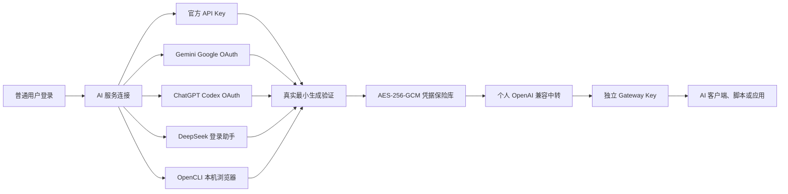

# TokHub

[](https://github.com/yaojingang/TokHub/releases)
[](https://github.com/yaojingang/TokHub/actions/workflows/ci.yml)
[](LICENSE)

TokHub 是面向 AI API 服务的开源监控、推荐运营和 OpenAI 兼容网关。它把公开状态页、供应商排行、用户工作区、个人 AI 账号连接、专属中转、分层探测、用量计量、告警审计和自托管部署放在一个系统里。

English: [README.en.md](docs/README.en.md)

当前版本：`v2.0.0-rc.1`，[查看发布说明](https://github.com/yaojingang/TokHub/releases/tag/v2.0.0-rc.1)

TokHub 2.0 把 AI 服务连接入口开放给普通用户。用户登录自己的工作区后，可以连接官方 API Key、官方 OAuth，也可以使用部署方显式开启的本机浏览器连接器，在自己的 Chrome 中调用已登录的 ChatGPT、Gemini 和 DeepSeek。连接通过验证后，TokHub 会生成个人 OpenAI 兼容中转和独立 Gateway Key。

> 本机浏览器连接、ChatGPT Codex OAuth 和 DeepSeek 网页账号属于自托管实验能力，默认关闭。Gemini Google OAuth 与官方 API Key 提供面向生产的接入路径。

## 快速导航

- [TokHub 2.0 的变化](#tokhub-20-的变化)
- [四种 AI 服务接入方式](#四种-ai-服务接入方式)
- [服务商支持矩阵](#服务商支持矩阵)
- [普通用户使用流程](#普通用户使用流程)
- [应用场景](#应用场景)
- [核心能力](#核心能力)
- [快速启动](#快速启动)
- [生产部署](#生产部署)
- [API](#api)

## TokHub 2.0 的变化

早期 TokHub 主要服务于平台运营者和企业工作区，负责公开监控、推荐运营、私有通道和多上游网关。2.0 增加普通用户的个人 AI 服务连接、授权生命周期和快速中转。

| 维度 | 2.0 之前 | 2.0 RC |
| --- | --- | --- |
| 使用入口 | 平台后台、公开前台和企业工作区 | 增加普通用户的“AI 服务连接”入口 |
| 上游凭据 | 平台或工作区配置 API Key | 增加用户自己的 API Key、官方 OAuth、受控实验授权和本机浏览器引用 |
| 支持服务 | OpenAI 兼容上游和平台通道 | 统一管理 OpenAI、Gemini、Kimi、DeepSeek、豆包、Claude 和千问 |
| 中转创建 | 管理员或工作区手动创建网关 | 已验证连接可以快速创建个人中转 |
| 协议适配 | OpenAI 兼容网关和常规供应商适配 | 增加 Gemini SSE、ChatGPT Responses、DeepSeek 网页协议桥和 OpenCLI 本机任务路由 |
| 凭据生命周期 | API Key 加密保存、轮换和删除 | 增加 OAuth 刷新、失效检测、账号一致性检查和重新授权 |
| 风控范围 | 网关 QPS、月配额、熔断和审计 | 实验连接增加个人范围、单中转、低 QPS 和并发限制 |
| 监控范围 | 通道探测、网关请求和成本 | 增加授权成功率、刷新失败、待重新授权连接和个人中转指标 |



## 四种 AI 服务接入方式

| 接入方式 | TokHub 获取什么 | 支持范围 | 续期方式 | 推荐场景 |
| --- | --- | --- | --- | --- |
| 官方 API Key | 开发者平台签发的 API Key | 七家服务商 | 用户轮换 Key | 生产调用、团队共享、稳定中转 |
| 官方 OAuth | OAuth Access Token、Refresh Token 和账号标识 | Gemini Google OAuth | 后台自动刷新，失效后重新授权 | 用户拥有 Google Cloud Project，希望减少手动管理 Key |
| 受控实验授权 | ChatGPT 一次性 OAuth 回调，或 DeepSeek `userToken.value` | ChatGPT、DeepSeek | 按服务商能力刷新，或提示用户重新登录 | 个人自托管、低频使用和协议验证 |
| 本机浏览器连接 | 连接器 ID、在线状态和任务结果；网页登录态留在用户电脑 | ChatGPT、Gemini、DeepSeek | 用户在 Chrome 重新登录，TokHub 重新识别 | 个人低频文本调用、网页流程验证、无需开发者 Key 的本机实验 |

### OpenCLI 本机浏览器连接

本机模式使用独立的 `tokhub-opencli-connector` 进程，链路为：

```text
个人 Gateway Key → TokHub 受限任务队列 → 本机连接器 → OpenCLI → 已连接的 Chrome Profile
```

安全边界固定为：

- TokHub 只允许 `whoami` 和 `ask` 两类任务，支持 ChatGPT、Gemini、DeepSeek 三个固定适配器。
- 连接器使用参数数组启动 OpenCLI，服务端无法下发通用 JavaScript、Cookie 读取、网络请求、截图或任意命令。
- Cookie、Session、Local Storage 与消费者 Token 保留在用户电脑，数据库保存经过加密的连接器引用。
- `whoami` 在本机把账号稳定标识转换为设备密钥派生的 HMAC-SHA-256 指纹；创建连接时完成绑定，每次 `ask` 前再次核对，账号切换会立即停止请求。
- 每个连接器同一时间只处理一个任务；每位 TokHub 用户对每家服务商最多保留一个本机网页连接，个人中转固定单并发、单中转。
- 最小间隔、小时额度和每日额度按 TokHub 用户与服务商持久化，重新配对设备或重建连接不会重置保护窗口；该连接的全部 Gateway Key 和中转共享额度。
- DeepSeek 默认最小间隔 15 秒、每小时 20 次、每日 80 次；ChatGPT 与 Gemini 默认最小间隔 10 秒、每小时 30 次、每日 120 次。
- 验证码、403、429、登录失效和网页适配器变化会进入持久化锁定或冷却状态，服务重启后保护仍然有效。
- 首版接受纯文本非流式请求；工具调用、图片、流式响应、Anthropic Messages 与团队共享会被明确拒绝。
- `chatgpt-web`、`gemini-web`、`deepseek-web` 是个人 API 的路由别名，实际网页模型由 OpenCLI 已连接的 Chrome Profile 与适配器决定。
- 页面出现验证码或安全挑战时，连接器停止任务并提示用户返回 Chrome 处理。

部署方启用：

```bash
TOKHUB_AI_OPENCLI_BROWSER_EXPERIMENTAL=true
TOKHUB_AI_OPENCLI_BROWSER_ACK=I_ACCEPT_OPENCLI_PERSONAL_BROWSER_EXPERIMENTAL_RISK
TOKHUB_AI_OPENCLI_BROWSER_TASK_TIMEOUT=2m
TOKHUB_AI_OPENCLI_CHATGPT_ENABLED=true
TOKHUB_AI_OPENCLI_GEMINI_ENABLED=true
TOKHUB_AI_OPENCLI_DEEPSEEK_ENABLED=true
```

三家服务可以独立关闭。请求间隔与小时、每日额度可以通过 `.env.example` 中的
`TOKHUB_AI_OPENCLI_<PROVIDER>_*` 变量调整。Redis 限流不可用时，本机浏览器中转会安全关闭。

用户电脑需要安装 [OpenCLI](https://github.com/jackwener/OpenCLI) `1.8.6` 或更高版本，并完成 Chrome 扩展连接。OpenCLI 官方 npm 包可按下面的命令安装或更新：

```bash
npm install -g @jackwener/opencli
opencli --version
opencli doctor
```

在 TokHub 的“AI 服务连接”页面点击“添加本机连接器”，复制页面生成的一次性命令。连接器可从 TokHub 源码构建：

```bash
go build -o ./bin/tokhub-opencli-connector ./cmd/tokhub-opencli-connector
./bin/tokhub-opencli-connector pair --server https://tokhub.example.com --code <页面显示的一次性配对码>
./bin/tokhub-opencli-connector run
```

选择 ChatGPT、Gemini 或 DeepSeek 的“连接本机已登录网页”后，页面会提供两个连续入口：

1. “打开服务商登录”用于在 Chrome 新标签页完成登录。
2. “已登录，识别并连接”通过本机 OpenCLI `whoami` 识别当前账号。已经登录的用户可以直接执行这一步。

连接详情会展示本小时用量、近 24 小时用量、冷却时间、安全验证记录和连续失败次数，并提供“重新识别账号”“立即暂停”和“恢复中转”操作。每位 TokHub 用户对每家服务商最多保留一个本机网页连接，该连接的多个 Gateway Key 和中转共享同一保护额度。403 会锁定 24 小时，冷却与锁定期间不能通过暂停、恢复或重新配对提前解除。

`doctor` 可检查 OpenCLI 版本、配置文件和 TokHub 连通性：

```bash
./bin/tokhub-opencli-connector doctor
```

连接器运行期间每 15 秒复查 Chrome Bridge，并用独立心跳维持 TokHub 在线状态；网页生成耗时较长时，心跳仍会持续发送。

如果 Chrome 中存在多个 OpenCLI 配置档案，请先用 `opencli profile list` 查看，再用 `opencli profile use <别名或 contextId>` 固定本连接器使用的档案。

`./bin/tokhub-opencli-connector --help` 会显示完整命令说明，`version` 会显示连接器对应的 TokHub 版本。

本机浏览器连接减少了服务端直接持有网页凭据的暴露面。消费者网页协议、服务商规则与账号风控仍然适用，该模式不承诺账号不会受到限制。

TokHub AI 登录助手的读取范围经过固定限制：

- ChatGPT 只识别 `http://localhost:1455/auth/callback` 中的一次性 `code` 和 `state`。
- Gemini 跳转 Google 官方授权页，并校验 Cloud Project 权限、OIDC 签名、nonce 和账号标识。
- DeepSeek 只在用户点击后读取 `https://chat.deepseek.com` 的 `localStorage.userToken.value`。
- 助手不读取服务商密码、验证码、完整 Cookie、`cf_clearance` 或其它 Local Storage 数据，也不持久化识别结果。
- 服务端完成真实最小生成验证后才保存连接，凭据使用版本化 AES-256-GCM 密钥环加密。

## 服务商支持矩阵

| 服务商 | 官方 API Key | 账号授权方式 | 当前级别 | 说明 |
| --- | --- | --- | --- | --- |
| ChatGPT / OpenAI | 支持 | Codex OAuth、本机 OpenCLI 浏览器 | 实验 | 本机模式保留网页登录态在用户电脑；个人范围、单中转、低 QPS |
| Gemini | 支持 | Google 官方 OAuth、本机 OpenCLI 浏览器 | OAuth 配置后可用，本机模式实验 | OAuth 需要 Cloud Project；本机模式调用已连接 Chrome Profile 中的 Gemini 网页 |
| Kimi | 支持 | 暂无 | 稳定 | 支持中国大陆和国际 Endpoint |
| DeepSeek | 支持 | 开放平台引导、网页账号登录态、本机 OpenCLI 浏览器 | API Key 稳定，网页路径实验 | OpenCLI 模式通过已连接 Chrome Profile 执行文本任务；DS2API 兼容路径继续保留 |
| 豆包 | 支持 | 暂无 | 稳定 | 使用火山方舟 API Key |
| Claude | 支持 | 暂无 | 稳定 | 使用 Anthropic API Key |
| 千问 | 支持 | 暂无 | 稳定 | 支持多地域和可选 Workspace Endpoint |

部署管理员可以通过功能开关逐项开放授权入口。网页登录和实验授权开关默认保持关闭，详细配置和灰度检查见 [AI 账号授权与个人中转运行手册](docs/AI_WEB_AUTH_OPERATIONS.md)。

## 普通用户使用流程

1. 登录 TokHub，进入“个人空间 > AI 服务连接”。
2. 选择 ChatGPT、Gemini、Kimi、DeepSeek、豆包、Claude 或千问。
3. 选择官方 API Key、官方 OAuth、受控授权或“连接本机已登录网页”。
4. 本机模式先完成一次性设备配对，并保持 Chrome 与连接器运行。
5. TokHub 按连接方式验证账号身份和可用性；本机浏览器模式创建时执行 `whoami`，第一次中转请求完成真实生成链路验证。
6. 连接可用后创建个人中转，设置模型、名称和额度。
7. 创建 Gateway Key，把 Base URL 设置为 `https://<your-domain>/gateway/v1`。
8. 在 OpenAI 兼容客户端、脚本或应用中使用该 Base URL 和 Gateway Key。

授权过期、账号不一致或上游返回明确鉴权错误时，连接会进入 `reauth_required`。用户可以在原连接上重新授权，原中转配置和用量记录继续保留。

## 应用场景

| 场景 | 适合的用户 | 推荐组合 |
| --- | --- | --- |
| AI API 状态与导航站 | 社区、媒体、模型服务运营者 | 公开状态页、供应商排行、精选推荐、只读 Open API |
| 多上游容灾网关 | 企业研发团队、AI 应用团队 | 私有通道、L1/L2/L3 探测、延迟或成功率路由、熔断 |
| 个人 AI 中转站 | 有多个 AI 账号或开发者 Key 的个人用户 | AI 服务连接、个人中转、独立 Gateway Key、用量审计 |
| 本机网页账号实验 | 已在 Chrome 登录 ChatGPT、Gemini 或 DeepSeek 的个人用户 | OpenCLI 本机连接器、纯文本非流式个人中转、单并发保护 |
| 室友或小团队共享 | 需要按成员控制额度的小团队 | 官方开发者凭据、工作区成员、成员 Gateway Key、QPS 和月配额 |
| 中转站运营后台 | 提供 AI API 服务的运营团队 | 通道治理、推荐配置、成本估算、用量报表、告警和审计 |
| 自托管授权实验室 | 需要验证 OAuth 或消费者协议适配的开发者 | 功能开关、独立协议桥、低频率限制、Prometheus 指标和紧急关闭 |

ChatGPT Codex 和 DeepSeek 网页登录态固定用于连接持有人本人。室友或团队共享场景应使用服务商官方开发者凭据，并遵守对应服务商的账户条款和使用限制。

## 核心能力

### 公开监控和推荐前台

- 公开首页、通道列表、通道详情、供应商排行和精选推荐。
- 支持按品牌、模型、状态、价格、延迟、成功率等维度组织展示。
- 前台推荐页由后台配置驱动，支持精选位、新人福利、场景推荐和多套榜单规则。
- 提供 `/api/public/*` 公开数据接口和 `/v1/status/*` 第三方只读 Open API。
- 支持生成独立通道站点资产，便于把公开监控和推荐能力拆给不同站点使用。

### 用户工作区

- 用户可以收藏公开通道，也可以创建自己的私有通道。
- 私有通道支持 Endpoint、模型、额度、状态、立即探测和连接测试。
- 用户工作区包含专属网关、Gateway Key、成员、用量、告警、事件和审计。
- 工作区数据按组织隔离，普通用户不能访问平台后台和其它工作区资源。

### 个人 AI 账号和专属中转

- 七家服务商统一使用 Provider Manifest，集中管理地域、Endpoint、协议、模型和验证方式。
- API Key、OAuth 和实验授权连接都要通过真实最小生成验证。
- OAuth 凭据支持后台刷新、退避、失效检测、账号一致性检查、重新授权、撤销和审计。
- ChatGPT、Gemini 和 DeepSeek 的本机浏览器连接执行个人范围、单中转、低 QPS、单并发和安全挑战停止保护。
- 连接验证通过后可以创建个人 OpenAI 兼容中转，并使用独立 Gateway Key。

### 平台管理后台

- 管理平台通道、私有通道、用户、组织、成员、Gateway Key、Open API 站点和推荐运营配置。
- 支持通道 CSV 导入导出、通道同步、批量启停、批量删除和二次密码验证。
- 支持全局用量报表、请求事件、成本估算、审计导出和治理概览。
- 支持站点配置、前台文案、模型目录和价格配置的后台维护。

### OpenAI 兼容专属网关

- 对外暴露 `/gateway/v1/*`，兼容 OpenAI 风格的 Models、Chat Completions 和 Responses 调用。
- 每个网关可以绑定多个平台上游或用户私有上游。
- Gateway Key 支持 QPS、月配额、状态管理、撤销、删除和一次性明文展示。
- 兼容非流式和流式响应，记录请求模型、上游通道、状态码、Token、延迟、成本和错误类型。

## 探测和健康算法

TokHub 把通道健康拆成三层，不把“接口能连上”和“模型真的能生成”混为一谈。

### L1 连通性探测

L1 负责基础网络链路：

- 解析 Endpoint URL。
- DNS 解析目标主机。
- 建立 TCP 连接。
- 对 HTTPS 目标执行 TLS 握手，并记录证书过期时间。
- 发起 HTTP HEAD 请求，判断入口是否可达。

L1 能定位 `dns_failed`、`tcp_failed`、`tls_failed`、`http` 层错误和坏 Endpoint。

### L2 模型可用性探测

L2 调用上游 `/models`，验证：

- API Key 是否有效。
- 上游是否返回可解析的模型列表。
- 当前配置的模型是否存在或可用。
- 部分供应商可按 provider profile 跳过模型列表探测。

L2 会把 401、403 识别为 `auth_error`，把模型缺失识别为 `model_not_found`。

### L3 真实生成探测

L3 发起最小 Chat Completions 请求，提示词要求模型只返回固定内容，用来验证真实推理链路：

- 记录总延迟、首 Token 估算、HTTP 状态、Token 用量和成本。
- 校验生成内容是否符合预期，避免“HTTP 成功但模型没有正常生成”的假阳性。
- 对慢响应、限流、空内容、鉴权失败和模型不可用分别归类。

### 状态合成

系统会把 L1、L2、L3 的结果合成通道状态：

- `healthy`：网络、模型和生成链路正常。
- `degraded`：仍可用，但存在慢响应、限流、模型探测异常或局部网络问题。
- `connectivity_down`：基础连接或模型列表链路不可达。
- `functional_down`：网络可能可达，但真实生成链路失败。
- `auth_error`：上游凭据失效或权限不足。
- `unknown`：探测数据不足。

健康评分会结合当前状态和成功率生成，快照会记录 24 小时可用率、成功率、P95 延迟、L1/L2/L3 延迟、Token 和成本。

## 网关路由算法

专属网关会先读取网关绑定的上游，再生成候选路由：

1. 跳过未启用上游。
2. 优先过滤 `connectivity_down`、`auth_error`、`functional_down` 等故障上游。
3. 如果全部候选都故障，则退回到所有启用上游，避免空路由。
4. 按网关策略排序。
5. 跳过短期熔断中的通道。
6. 把本次路由计划写入 Redis，便于观测和后续扩展。

支持三种策略：

- `latency`：按 P95 延迟从低到高排序，同分时健康评分高的优先。
- `success`：按成功率从高到低排序，同分时健康评分高的优先。
- `cost`：按成本从低到高排序，同分时健康评分高的优先。

Redis 还承担 Gateway QPS 秒级桶、通道短期熔断标记和路由计划缓存。即使 Redis 不可用，服务也会降级到内存熔断和数据库路由，不直接中断核心网关能力。

## 安全和加密

TokHub 默认把密钥材料当作生产数据处理。

- 上游 API Key、私有通道 Key 和通知目标使用 AES-GCM 加密保存。
- 主密钥由 `TOKHUB_SECRET_KEY` 派生，生产环境要求至少 32 字符。
- 每次加密使用随机 nonce，数据库保存 ciphertext、nonce、mask 和 fingerprint。
- Gateway Key 使用 `sk-th-` 前缀随机生成，服务端保存 SHA-256 哈希、短前缀和 mask。
- 完整 Gateway Key 只在创建响应中展示一次，后续只能轮换或重新签发。
- 登录密码使用 bcrypt 保存，Session Token 只保存哈希。
- 本机浏览器设备令牌与任务租约只保存 SHA-256 哈希；配对码一次有效，任务完成后立即清除请求正文。
- 浏览器写操作使用 Cookie + CSRF Token 双重校验。
- 生产环境要求 `TOKHUB_SESSION_SECURE=true`，避免明文 Cookie。
- 官网抓取和通道介绍解析会阻断 localhost、内网、链路本地、组播、保留地址和文档网段，降低 SSRF 风险。
- 删除通道、删除用户和治理动作会清理或擦除相关密钥材料，并写入审计事件。

## 技术栈

| 层级 | 技术 |
| --- | --- |
| 后端 | Go、go-chi、pgx、sqlc、bcrypt |
| 前端 | React、Vite、TypeScript、React Router、Radix UI |
| 数据库 | PostgreSQL、TimescaleDB、迁移 SQL、sqlc 生成查询 |
| 缓存和限流 | Redis |
| 事件和任务扩展 | NATS |
| 探测和网关 | L1/L2/L3 Probe、OpenAI 兼容网关、Anthropic/Gemini/OpenAI 适配 |
| 部署 | Dockerfile、Docker Compose、分 role Compose、Helm 模板 |
| 验证 | Go test、go vet、TypeScript、Vite build、Playwright、发布脚本和安全扫描 |

## 架构特点

### 单入口，多角色

后端只有一个 Go 入口 `cmd/tokhub`，通过 `TOKHUB_ROLE` 切换运行角色：

- `all`：单进程运行 Web、API、Gateway、探测和任务能力，适合本地和小团队自托管。
- `api`：只运行公开前台、用户控制台、平台后台和 Open API。
- `gateway`：只运行 OpenAI 兼容专属网关。
- `prober`：运行探测任务。
- `worker`：运行异步任务扩展。
- `migrate`：执行数据库迁移。
- `seed`：初始化管理员、默认组织、站点配置和模型目录。

### 从单容器到分角色

默认部署用单容器 Compose，适合最小化运维成本。需要扩展时，可以叠加 `deploy/compose/docker-compose.roles.yml`，把 API、Gateway、Prober 和 Worker 拆开部署。

### 数据模型围绕真实运营

核心表包括用户、组织、通道、通道凭据、模型目录、模型价格、探测运行、探测快照、Incident、Gateway、Gateway Key、请求事件、用量 Rollup、告警、通知通道、审计和 Open API 站点。该数据模型直接服务于真实运营、监控和网关调用。

### 发布硬化

仓库包含开源发布预检、生产变量预检、无演示数据检查、备份、恢复演练、安全扫描、Compose 配置校验、Docker 构建和 smoke 测试脚本。发布前可以用一个命令跑基础门禁。

## 快速启动

```bash
cp -n .env.example .env || true
docker compose up -d --build
```

默认入口：

- Web / API / Gateway：`http://localhost:8080`
- OpenAPI：`http://localhost:8080/openapi.yaml`
- Metrics：`http://localhost:8080/metrics`
- Gateway：`http://localhost:8080/gateway/v1/*`
- 本地开发管理员账号：`admin`
- 本地开发默认密码：`admin@tokhub.local`

上述账号和密码也是默认后台管理入口的登录账号和登录密码，只用于本地开发。生产环境必须在 `.env.production` 中替换 `TOKHUB_ADMIN_PASSWORD` 和 `TOKHUB_SECRET_KEY`。

服务启动后的轻量冒烟：

```bash
TOKHUB_BASE_URL=http://localhost:8080 npm run test:smoke
```

## 本地验收

基础检查：

```bash
go test ./...
go vet ./...
sqlc generate
npm run typecheck
npm run lint
npm run build
npm run test:security
docker compose config
```

应用启动后可以继续跑：

```bash
npm run test:ops
npm run test:restore
npm run test:e2e
npm run test:visual
```

发布前建议运行：

```bash
deploy/scripts/release-check.sh
```

如果本地 Docker 服务已启动，并且要做完整发布检查：

```bash
RUN_DB_CHECK=1 RUN_RESTORE=1 RUN_E2E=1 RUN_VISUAL=1 RUN_SMOKE=1 deploy/scripts/release-check.sh
```

## 生产部署

生产环境不要使用 `.env.example` 中的开发默认值。至少需要准备：

- `TOKHUB_PUBLIC_URL`
- `TOKHUB_ADMIN_EMAIL`
- `TOKHUB_ADMIN_PASSWORD`
- `TOKHUB_SECRET_KEY`
- `DATABASE_URL`
- `REDIS_URL`
- `NATS_URL`
- `SMTP_URL`，如果需要真实邮件通知

生产环境推荐保持：

- `TOKHUB_ENV=production`
- `TOKHUB_SEED_MODE=prod`
- `TOKHUB_UPSTREAM_MODE=real`
- `TOKHUB_SESSION_SECURE=true`
- `TOKHUB_EXPOSE_DEV_TOKENS=false`

单容器发布：

```bash
cp .env.production.example .env.production
# 填入真实密钥、域名和外部依赖地址
deploy/scripts/preflight.sh --env-file .env.production
docker compose --env-file .env.production up -d --build
curl -fsS "$TOKHUB_PUBLIC_URL/healthz"
curl -fsS "$TOKHUB_PUBLIC_URL/readyz"
```

分角色发布：

```bash
docker compose --env-file .env.production -f docker-compose.yml -f deploy/compose/docker-compose.roles.yml up -d --build
```

更多细节见 [部署说明](docs/DEPLOYMENT.md)、[发布流程](docs/RELEASE.md) 和 [恢复演练](docs/RECOVERY-DRILL.md)。

## API

- 人可读 API 接入说明：[docs/API.md](docs/API.md)
- 机器可读 OpenAPI 合同：[docs/openapi.yaml](docs/openapi.yaml)
- 管理员 Agent API：[docs/admin-agent-api.md](docs/admin-agent-api.md)
- 管理员 Agent OpenAPI：[docs/admin-agent.openapi.yaml](docs/admin-agent.openapi.yaml)
- 运行中服务 OpenAPI：`http://localhost:8080/openapi.yaml`

主要 API 分层：

- `/api/public/*`：公开前台数据。
- `/api/auth/*`：注册、登录、会话、邮箱验证和密码重置。
- `/api/me/*`：个人收藏和私有通道。
- `/api/console/*`：用户或企业工作区。
- `/api/admin/*`：平台管理后台。
- `/v1/status/*`：第三方状态 Open API。
- `/gateway/v1/*`：OpenAI 兼容专属网关。

## 目录

- `cmd/tokhub/`：单入口进程，按 `TOKHUB_ROLE` 启动不同角色。
- `internal/`：后端模块，包括 API、认证、加密、探测、网关、事件和数据访问。
- `web/`：React / Vite 前端。
- `db/`：数据库迁移和 sqlc 查询。
- `deploy/`：Compose、Helm、备份恢复、压测和发布脚本。
- `docs/`：API、部署、发布、恢复、开源规则和机器合同文档。
- `tests/`：Playwright 端到端和视觉测试。

## License

TokHub is licensed under the Apache License, Version 2.0. See [LICENSE](LICENSE) and [NOTICE](NOTICE).
