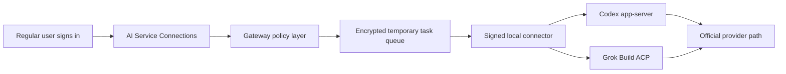

# TokHub

[](https://github.com/yaojingang/TokHub/releases)
[](https://github.com/yaojingang/TokHub/actions/workflows/ci.yml)
[](../LICENSE)

TokHub is an open-source monitoring, recommendation, and OpenAI-compatible gateway for AI API services. It combines public status pages, provider rankings, user workspaces, personal AI account connections, dedicated relays, layered probes, usage metering, alerts, audit logs, and self-hosted deployment in one system.

Simplified Chinese: [README.md](../README.md)

Current release: `v2.0.0-rc.2`. [Read the release notes](https://github.com/yaojingang/TokHub/releases/tag/v2.0.0-rc.2).

TokHub 2.0 RC2 organizes personal AI connectivity into official developer APIs, official local account clients, and a local lab. ChatGPT delegates to the official Codex `app-server`; Grok delegates to the official Grok Build ACP. Both clients run inside a dedicated read-only container on the user's device. Gemini retains API key and Google Cloud OAuth support. DeepSeek production connections accept the official API key only.

> OpenCLI, DeepSeek web sessions, and legacy ChatGPT Codex OAuth are lab-only. Lab connections cannot create production Gateway Keys. The RC2 safety migration disables legacy connections, erases their consumer token ciphertext, and disables managed channels backed by them.

## Quick Navigation

- [What Changed In TokHub 2.0](#what-changed-in-tokhub-20)
- [Three Connection Tiers](#three-connection-tiers)
- [Official Client Connector](#official-client-connector)
- [Provider Support Matrix](#provider-support-matrix)
- [Regular User Flow](#regular-user-flow)
- [Use Cases](#use-cases)
- [Core Features](#core-features)
- [Quick Start](#quick-start)
- [Production Deployment](#production-deployment)
- [API](#api)

## What Changed In TokHub 2.0

Earlier TokHub releases focused on platform operators and enterprise workspaces through public monitoring, recommendation operations, private channels, and multi-upstream gateways. Version 2.0 adds personal AI service connections, authorization lifecycle management, and quick personal relays for regular users.

| Area | Before 2.0 | 2.0 RC |
| --- | --- | --- |
| Personal account path | Consumer OAuth, web sessions, and OpenCLI experiments | Official Codex and Grok Build local delegation |
| Production policy | Experimental connection types could reach a personal relay | API keys, Gemini OAuth, and ChatGPT/Grok official clients only |
| Local isolation | Browser tools shared the user environment | Non-root read-only container with named volumes and no home-directory mount |
| Device trust | Device token and task lease | Ed25519 request signatures, 60-second timestamp window, nonce replay protection, and HTTPS |
| Conversation state | Caller resubmitted the full conversation | `/v1/responses` can restore an official client session with `previous_response_id` |
| Account protection | Adapter-specific low-volume limits | One device, one connection, concurrency 1, 15-second interval, 20/hour, 80/day, zero retry |
| Governance | Feature switches | Compiled Provider Policy, 90-day review, terms digest, and kill switch |



## Three Connection Tiers

| Tier | What TokHub stores | Providers | Production Gateway | Recommended use |
| --- | --- | --- | --- | --- |
| Official API | Encrypted API key or Gemini OAuth bundle | OpenAI, Gemini, Kimi, DeepSeek, Doubao, Claude, Qwen, Grok | Yes | Production applications and team quotas |
| Official local account client | Encrypted device reference, account fingerprint, and risk state | ChatGPT Codex, Grok Build | Yes, personal scope | Low-volume text use with a personal membership |
| Local lab | Device reference and experimental state | OpenCLI, DeepSeek web session, legacy Codex OAuth | No | Protocol research and self-hosted adapter validation |

## Official Client Connector

`tokhub-client-connector` supports `doctor`, `pair`, `login`, `run`, `logout`, and `sessions clean`. Pairing creates an Ed25519 key inside the container. Every request signs the method, path, body hash, timestamp, and nonce.

The image pins `@openai/codex@0.148.0` and the official Grok Build `1.0.5` binary. xAI does not currently publish a verifiable `@xai-official/grok@0.1.4` package to the public npm registry, so RC2 uses xAI's official binary release and verifies its SHA256.

The container runs as non-root with a read-only root filesystem, all Linux capabilities removed, and no host directory mounts. Codex runs in an empty read-only workspace with approvals disabled. A root-owned Grok requirements policy denies every tool. Tool, file, or command events interrupt the task and move the connection to `policy_locked`.

## Provider Support Matrix

| Provider | Official API key | Account authorization | Current level | Notes |
| --- | --- | --- | --- | --- |
| ChatGPT / OpenAI | Supported | Codex `app-server` | Production personal client | Text only, one device, one connection, concurrency 1 |
| Gemini | Supported | Official Google OAuth | Production after configuration | Requires a Cloud Project, HTTPS callback, and Redis |
| Kimi | Supported | Unavailable | Stable | Supports mainland China and international endpoints |
| DeepSeek | Supported | Unavailable in production | Stable API key | OpenCLI and web sessions remain in the lab profile |
| Doubao | Supported | Unavailable | Stable | Uses a Volcano Ark API key |
| Claude | Supported | Unavailable | Stable | Uses an Anthropic API key |
| Qwen | Supported | Unavailable | Stable | Supports multiple regions and optional workspace endpoints |
| Grok | Supported | Grok Build ACP | Production personal client | Device-level identity is used when ACP exposes no stable account subject |

Deployment administrators enable each authorization entry separately. All web authorization switches remain disabled by default. See [AI account authorization and personal relay operations](AI_WEB_AUTH_OPERATIONS.md) for configuration and rollout checks.

## Regular User Flow

1. Sign in to TokHub and open **Personal Space > AI Service Connections**.
2. Select ChatGPT, Gemini, Kimi, DeepSeek, Doubao, Claude, or Qwen.
3. Choose **Official API**, **Official local account**, or **Local lab**.
4. For ChatGPT or Grok, create a connector, pair it with a ten-minute code, and complete device authentication inside the dedicated container.
5. TokHub verifies the official client identity, current model catalog, device capability, and safety policy.
6. Create a personal relay from the verified connection and select its models, name, and quota.
7. Create a Gateway Key and set the client Base URL to `https://<your-domain>/gateway/v1`.
8. Use that Base URL and Gateway Key in an OpenAI-compatible client, script, or application.

When authorization expires, the account identity changes, or an upstream returns a definitive authentication failure, the connection enters `reauth_required`. The user can reauthorize the existing connection while keeping the relay configuration and usage history.

## Use Cases

| Use case | Intended users | Recommended TokHub components |
| --- | --- | --- |
| AI API status and directory site | Communities, media teams, and model service operators | Public status pages, provider rankings, curated recommendations, and read-only Open API |
| Multi-upstream failover gateway | Enterprise engineering and AI application teams | Private channels, L1/L2/L3 probes, latency or success routing, and circuit breakers |
| Personal AI relay | Individuals with several AI accounts or developer keys | AI service connections, personal relay, dedicated Gateway Key, and usage audit |
| Roommate or small-team access | Small groups that need per-member quotas | Official developer credentials, workspace members, member Gateway Keys, QPS, and monthly quotas |
| Relay service operations | Teams that operate AI API services | Channel governance, recommendation configuration, cost estimates, usage reports, alerts, and audits |
| Self-hosted authorization lab | Developers evaluating OAuth or consumer protocol adapters | Feature flags, isolated bridges, low-volume limits, Prometheus metrics, and emergency shutdown |
| Official personal account relay | ChatGPT Codex or Grok Build users | Dedicated connector container, fixed personal model alias, one concurrent request, and durable risk controls |
| Local protocol lab | Self-hosted adapter researchers | OpenCLI or DeepSeek session adapters with production Gateway isolation |

Official client connections are limited to their owner. Roommate and team access should use official developer credentials and follow provider account terms and usage limits.

## Core Features

### Public Monitoring And Recommendations

- Public home page, channel list, channel detail pages, provider rankings, and curated recommendations.
- Filters and views for provider, model, status, price, latency, success rate, and health score.
- Admin-managed recommendation slots, newcomer offers, scenario recommendations, and ranking rules.
- Public `/api/public/*` endpoints and third-party `/v1/status/*` Open API.
- Optional generated channel-site assets for standalone public monitoring and recommendation pages.

### User Workspaces

- Users can favorite public channels and create private channels with their own endpoints and keys.
- Private channels support endpoint configuration, model selection, daily probe quota, status tracking, manual probes, and connection validation.
- Each workspace has gateways, Gateway Keys, members, usage analytics, alerts, incidents, and audit logs.
- Workspace data is isolated by organization. Regular users cannot access platform admin data or other workspaces.

### Personal AI Accounts And Dedicated Relays

- A shared Provider Manifest defines region, endpoint, protocol, model, and validation behavior for all eight providers.
- API key, OAuth, and official client connections perform method-specific availability and identity checks.
- OAuth credentials support background refresh, backoff, expiry detection, account consistency checks, reauthorization, revocation, and auditing.
- ChatGPT Codex and Grok Build official client connections enforce personal scope, one device, one connection, low frequency, and concurrency 1.
- Local lab connections are isolated from production Gateways, and the RC2 migration erases legacy consumer credential ciphertext.
- A verified connection can create a personal OpenAI-compatible relay with its own Gateway Key.

### Platform Admin Console

- Manage platform channels, private channels, users, organizations, members, Gateway Keys, Open API sites, and recommendation content.
- Import, export, sync, enable, disable, and delete channels with guardrails such as password confirmation.
- View global usage, request events, cost estimates, audit exports, and governance summaries.
- Maintain site configuration, public copy, model catalog, and model pricing from the admin console.

### OpenAI-Compatible Dedicated Gateway

- Exposes `/gateway/v1/*` with OpenAI-style Models, Chat Completions, and Responses behavior.
- Each gateway can bind multiple platform upstreams or user-owned private upstreams.
- Gateway Keys support QPS limits, monthly quota, status management, revocation, deletion, and one-time plaintext reveal.
- Supports streaming and non-streaming responses.
- Records request model, upstream channel, status code, tokens, latency, cost, error type, and usage estimation state.

## Probe And Health Model

TokHub separates channel health into three layers so network reachability is not confused with real model availability.

### L1 Connectivity Probe

L1 validates the basic network path:

- Parse the endpoint URL.
- Resolve DNS.
- Open a TCP connection.
- Perform a TLS handshake for HTTPS targets and record certificate expiry.
- Send an HTTP HEAD request.

This layer classifies DNS, TCP, TLS, HTTP, and malformed endpoint failures.

### L2 Model Availability Probe

L2 calls the upstream `/models` endpoint to verify:

- Whether the API key is accepted.
- Whether the upstream returns a usable model list.
- Whether the configured model exists or is available.
- Whether a provider profile intentionally skips model-list probing.

Authentication failures are classified as `auth_error`; missing models are classified as `model_not_found`.

### L3 Real Generation Probe

L3 sends a minimal Chat Completions request and asks the model to return a fixed response. This verifies the real generation path:

- Records latency, estimated first token time, HTTP status, token usage, and cost.
- Checks whether the response content matches the expected output.
- Separates slow responses, rate limits, empty content, auth errors, and model failures.

### Status Synthesis

TokHub combines L1, L2, and L3 into channel states:

- `healthy`: connectivity, model listing, and generation are working.
- `degraded`: usable, but slow, rate limited, partially failing, or inconsistent.
- `connectivity_down`: network or model-list path is unavailable.
- `functional_down`: network may be reachable, but real generation fails.
- `auth_error`: credentials are invalid or unauthorized.
- `unknown`: not enough probe data.

Snapshots store 24-hour uptime, success rate, P95 latency, L1/L2/L3 latency, tokens, cost, and health score.

## Gateway Routing

Dedicated gateways build a route plan from configured upstreams:

1. Skip disabled upstreams.
2. Prefer to filter out `connectivity_down`, `auth_error`, and `functional_down` upstreams.
3. If every upstream is unhealthy, fall back to all enabled upstreams to avoid an empty route.
4. Sort candidates by gateway policy.
5. Skip upstreams currently in short circuit-breaker cooldown.
6. Store the route plan in Redis for observability and later extensions.

Supported policies:

- `latency`: lower P95 latency first, with health score as the tie breaker.
- `success`: higher success rate first, with health score as the tie breaker.
- `cost`: lower cost first, with health score as the tie breaker.

Redis is used for per-second QPS buckets, short circuit-breaker flags, and route-plan caching. If Redis is unavailable, the gateway falls back to in-memory circuit state and database-backed routing.

## Security And Encryption

TokHub treats credentials as production data:

- Upstream API keys, private-channel keys, and notification targets are encrypted with AES-GCM.
- `TOKHUB_SECRET_KEY` is used as the master secret and must be at least 32 characters in production.
- Each encryption operation uses a random nonce. The database stores ciphertext, nonce, mask, and fingerprint.
- Gateway Keys are generated with an `sk-th-` prefix and stored as SHA-256 hashes with a short prefix and mask.
- Full Gateway Keys are shown only once during creation.
- Login passwords are hashed with bcrypt.
- Session tokens are stored as hashes.
- Browser write requests require Cookie plus CSRF token validation.
- Production deployments should set `TOKHUB_SESSION_SECURE=true`.
- Public metadata fetching blocks localhost, private networks, link-local ranges, multicast ranges, reserved ranges, and documentation ranges to reduce SSRF risk.
- Delete and governance flows scrub related key material and write audit events.

## Technology Stack

| Layer | Stack |
| --- | --- |
| Backend | Go, go-chi, pgx, sqlc, bcrypt |
| Frontend | React, Vite, TypeScript, React Router, Radix UI |
| Database | PostgreSQL, TimescaleDB, SQL migrations, sqlc generated queries |
| Cache and rate limits | Redis |
| Events and workers | NATS |
| Probing and gateway | L1/L2/L3 probes, OpenAI-compatible gateway, Anthropic/Gemini/OpenAI adapters |
| Deployment | Dockerfile, Docker Compose, role-split Compose, Helm templates |
| Verification | Go test, go vet, TypeScript, Vite build, Playwright, release scripts, security scans |

## Architecture

### One Binary, Multiple Roles

The backend has one Go entrypoint, `cmd/tokhub`. Runtime behavior is selected with `TOKHUB_ROLE`:

- `all`: runs web, API, gateway, probes, and workers in one process.
- `api`: serves public pages, user console, admin console, and Open API.
- `gateway`: serves the OpenAI-compatible gateway.
- `prober`: runs probe workloads.
- `worker`: runs async worker tasks.
- `migrate`: runs database migrations.
- `seed`: initializes admin user, default organization, site config, and model catalog.

### From Single Container To Split Roles

The default deployment uses one Docker Compose stack for small teams and self-hosted setups. When traffic grows, `deploy/compose/docker-compose.roles.yml` can split API, gateway, prober, and worker roles.

### Operations-Oriented Data Model

TokHub models users, organizations, channels, channel credentials, model catalogs, model prices, probe runs, probe snapshots, incidents, gateways, Gateway Keys, request events, usage rollups, alerts, notification channels, audits, and Open API sites. The schema directly supports monitoring, gateway operations, and day-to-day administration.

### Release Hardening

The repository includes open-source preflight checks, production environment preflight, no-demo-data checks, backups, restore drills, security scans, Compose config validation, Docker builds, and smoke tests.

## Quick Start

```bash
cp -n .env.example .env || true
docker compose up -d --build
```

Default endpoints:

- Web / API / Gateway: `http://localhost:8080`
- OpenAPI: `http://localhost:8080/openapi.yaml`
- Metrics: `http://localhost:8080/metrics`
- Gateway: `http://localhost:8080/gateway/v1/*`
- Local admin username: `admin`
- Local admin password: `admin@tokhub.local`

These are also the default Platform Admin login credentials for local development only. Production deployments must replace `TOKHUB_ADMIN_PASSWORD` and `TOKHUB_SECRET_KEY` in `.env.production`.

Smoke test after startup:

```bash
TOKHUB_BASE_URL=http://localhost:8080 npm run test:smoke
```

## Local Verification

Basic checks:

```bash
go test ./...
go vet ./...
sqlc generate
npm run typecheck
npm run lint
npm run build
npm run test:security
docker compose config
```

After the app is running:

```bash
npm run test:ops
npm run test:restore
npm run test:e2e
npm run test:visual
```

Release gate:

```bash
deploy/scripts/release-check.sh
```

Full local release checks, when Docker is available:

```bash
RUN_DB_CHECK=1 RUN_RESTORE=1 RUN_E2E=1 RUN_VISUAL=1 RUN_SMOKE=1 deploy/scripts/release-check.sh
```

## Production Deployment

Do not use development defaults from `.env.example` in production. At minimum, configure:

- `TOKHUB_PUBLIC_URL`
- `TOKHUB_ADMIN_EMAIL`
- `TOKHUB_ADMIN_PASSWORD`
- `TOKHUB_SECRET_KEY`
- `DATABASE_URL`
- `REDIS_URL`
- `NATS_URL`
- `SMTP_URL`, if real email delivery is required

Recommended production settings:

- `TOKHUB_ENV=production`
- `TOKHUB_SEED_MODE=prod`
- `TOKHUB_UPSTREAM_MODE=real`
- `TOKHUB_SESSION_SECURE=true`
- `TOKHUB_EXPOSE_DEV_TOKENS=false`

Single-container deployment:

```bash
cp .env.production.example .env.production
# Fill real secrets, domain, and external service URLs.
deploy/scripts/preflight.sh --env-file .env.production
docker compose --env-file .env.production up -d --build
curl -fsS "$TOKHUB_PUBLIC_URL/healthz"
curl -fsS "$TOKHUB_PUBLIC_URL/readyz"
```

Role-split deployment:

```bash
docker compose --env-file .env.production -f docker-compose.yml -f deploy/compose/docker-compose.roles.yml up -d --build
```

More details:

- [Deployment](DEPLOYMENT.md)
- [Release](RELEASE.md)
- [Recovery drill](RECOVERY-DRILL.md)

## API

- Human-readable API guide: [API.md](API.md)
- Public OpenAPI contract: [openapi.yaml](openapi.yaml)
- Admin Agent API: [admin-agent-api.md](admin-agent-api.md)
- Admin Agent OpenAPI: [admin-agent.openapi.yaml](admin-agent.openapi.yaml)
- Runtime OpenAPI endpoint: `http://localhost:8080/openapi.yaml`

Main API namespaces:

- `/api/public/*`: public page data.
- `/api/auth/*`: registration, login, sessions, email verification, and password reset.
- `/api/me/*`: user favorites and private channels.
- `/api/console/*`: user or enterprise workspace.
- `/api/admin/*`: platform admin console.
- `/v1/status/*`: third-party read-only status Open API.
- `/gateway/v1/*`: OpenAI-compatible dedicated gateway.

## Repository Layout

- `cmd/tokhub/`: single backend entrypoint.
- `internal/`: backend modules for API, auth, crypto, probes, gateway, events, and data access.
- `web/`: React / Vite frontend.
- `db/`: SQL migrations and sqlc queries.
- `deploy/`: Compose, Helm, backup, restore, load test, and release scripts.
- `docs/`: API, deployment, release, recovery, open-source, and machine-contract documentation.
- `tests/`: Playwright end-to-end and visual tests.

## Open-Source Release

Read [OPEN_SOURCE.md](OPEN_SOURCE.md) before the first public release. Do not use `git add .` for the first public commit. Use the documented allowlist so local `.env` files, backups, temporary files, local binaries, private reviews, and prototype assets are not published.

Open-source preflight:

```bash
npm run open-source:preflight
```

## License

TokHub is licensed under the Apache License, Version 2.0. See [LICENSE](../LICENSE) and [NOTICE](../NOTICE).
