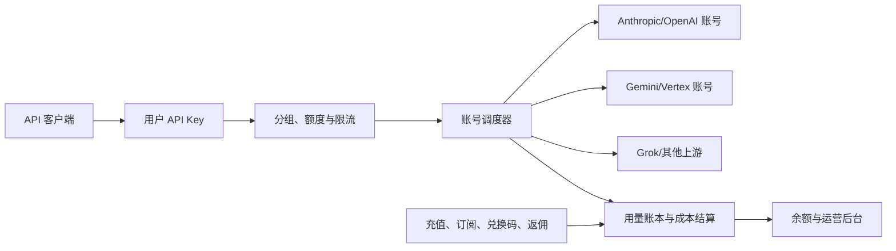
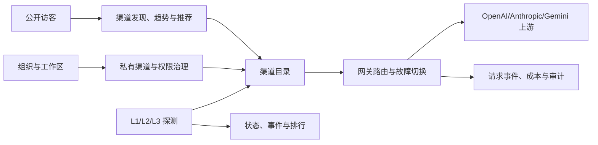
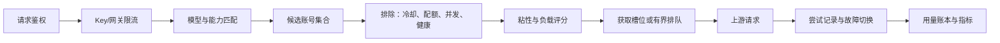

# sub2api 与 TokHub 深度对比及 TokHub 迭代建议

> 分析日期：2026-07-16
> sub2api 快照：`09c6c6d74050cf49ed2fb864be6c11647798ef53`
> TokHub 快照：`9cdcd2559610822ce9f029ac5a296c89cb7cbfd9`

## 1. 执行摘要

sub2api 和 TokHub 都覆盖 AI API 网关、上游接入、密钥管理、用量记录、健康监控和自托管运维。两者的产品重心明显不同：

- sub2api 面向 API 中转运营，重点是上游账号池、复杂调度、额度分发、精细计费和支付闭环。
- TokHub 面向渠道观测与治理，重点是公开发现、可用性诊断、推荐决策、组织工作区和安全网关。
- sub2api 在网关运行面、协议覆盖、账号调度和商业化运营能力上更成熟。
- TokHub 在公开观测面、分层诊断、多租户治理、密钥安全和 Agent 管理规范上更完整。

对 TokHub 最有价值的升级路径，是保留“观测、推荐、治理”的主定位，补强专业网关运行面。近期应优先建设限流与并发控制、路由透明度、模型映射、协议兼容测试和发布体验；中期再引入加密账号池、会话粘性、负载感知调度和精确用量账本。支付、余额、推广返佣等能力适合保持为条件性模块。

## 2. 分析范围与方法

本报告基于两个仓库的本地代码快照，检查范围覆盖：

- 项目定位、README、许可证和社区活跃度
- 后端依赖、前端依赖、数据模型和数据库迁移
- 网关入口、协议适配、路由、调度、重试和流式处理
- API Key、上游凭证、认证、权限和 SSRF 防护
- 监控、探测、告警、审计、备份、升级和部署
- 支付、订阅、额度、兑换码、推广和运营后台
- 自动化管理 Skill 的安全边界和治理方式

代码规模为本地快照统计值，已尽量排除生成代码和测试代码。GitHub 指标会持续变化，表内数据仅代表分析当日。

## 3. 项目快照

| 维度 | sub2api | TokHub |
| --- | --- | --- |
| 仓库 | [Wei-Shaw/sub2api](https://github.com/Wei-Shaw/sub2api) | [yaojingang/TokHub](https://github.com/yaojingang/TokHub) |
| 本地路径 | `<workspace>/sub2api` | `<workspace>/tokhub` |
| 分析提交 | `09c6c6d7`，2026-07-16 | `9cdcd255`，2026-07-13 |
| 最新发布 | [v0.1.156](https://github.com/Wei-Shaw/sub2api/releases/tag/v0.1.156)，2026-07-15 | 以源码构建和仓库发布流程为主 |
| 首次公开时间 | 2025-12-18 | 2026-07-06 |
| GitHub 指标 | 约 3.24 万 Star、6639 Fork | 184 Star、18 Fork |
| 本地提交历史 | 4852 个提交、321 位不同提交作者 | 29 个提交、2 位不同提交作者 |
| 近 30 天提交 | 约 950 个 | 项目处于早期快速建设阶段 |
| 许可证 | LGPL-3.0；README 另有商业使用提示 | Apache-2.0 |
| 后端 | Go 1.26、Gin、Ent、Wire | Go 1.26、Chi、pgx |
| 前端 | Vue 3、Vite 5、Pinia、Tailwind CSS | React 19、Vite 7、TypeScript、Radix UI |
| 基础设施 | PostgreSQL、Redis | PostgreSQL/TimescaleDB、Redis、NATS JetStream |
| 后端业务代码 | 约 29.8 万行 Go，不含 Ent 生成代码和测试 | 约 3.0 万行 Go，不含测试 |
| 前端业务代码 | 约 16.2 万行 TypeScript/Vue，不含测试 | 约 2.3 万行 TypeScript/TSX，不含测试 |
| 数据库迁移 | 222 个 | 44 个 |
| 自动化测试 | 868 个 Go 测试文件、159 个前端测试文件 | 32 个 Go 测试文件、36 个 Playwright 规格文件 |

这些数据说明 sub2api 已进入高频社区协作和大规模功能演进阶段。TokHub 仍在产品定型期，代码体量更小，架构调整成本也更低。

## 4. 产品定位与系统边界

### 4.1 sub2api

sub2api 的主流程围绕“用户购买或获得额度，通过 API Key 使用一组上游账号”展开。系统将账号、用户、分组、订阅、额度、费率和用量结算串成闭环。



核心能力包括：

- 多平台账号池和多种认证方式，包括 OAuth、API Key、Setup Token、Bedrock、Vertex 等
- 按模型、分组、优先级、负载、会话和账号状态进行调度
- 账号级与用户级并发、RPM、窗口额度和冷却控制
- OpenAI、Anthropic、Gemini 原生及扩展媒体接口
- 钱包、订阅、支付订单、退款、兑换码和推广返佣
- 实时 QPS、延迟、错误、系统日志、备份和在线升级

### 4.2 TokHub

TokHub 的主流程围绕“发现和验证渠道，形成可靠状态与推荐，再为团队提供受治理的专属网关”展开。系统将公开观测、工作区治理、私有渠道和网关调用连接起来。



核心能力包括：

- 公开渠道目录、状态、趋势、排行、推荐和 SEO 页面
- DNS/TCP/TLS/HTTP、鉴权/模型、最小生成挑战的三层探测
- 组织、工作区、成员、角色、私有渠道和平台管理
- OpenAI 与 Anthropic 入站兼容，以及多类上游适配
- 基于健康度、延迟、成功率和成本的路由与首字节前故障切换
- 事件、告警、审计、站点开放 API 和渠道站点打包
- 哈希存储网关密钥，加密保存上游凭证

## 5. 两个系统相同的部分

| 共同能力 | sub2api 的实现 | TokHub 的实现 | 共同价值 |
| --- | --- | --- | --- |
| Go 后端与 SPA 前端 | Gin + Ent + Vue | Chi + pgx + React | 部署简单，前后端职责清楚 |
| PostgreSQL 持久化 | 用户、账号、账单、运营数据 | 渠道、探测、工作区、网关事件 | 适合关系治理和统计分析 |
| Redis | 会话、调度、限流、缓存 | 限流、路由计划和缓存 | 支撑低延迟运行态 |
| API Key 调用 | 用户 Key 绑定分组与额度 | 网关 Key 绑定网关和配额 | 为程序化调用提供独立身份 |
| 多上游支持 | 平台账号池 | 多渠道与上游适配器 | 降低单供应商依赖 |
| OpenAI 兼容接口 | Chat、Responses、Embedding、媒体等 | Chat、Responses、Models | 兼容现有 SDK 和工具链 |
| Anthropic 兼容 | Messages、Token Count | Messages | 覆盖 Claude 生态 |
| 流式响应 | SSE、WebSocket 和多协议流 | SSE 和首字节前切换 | 改善长响应体验 |
| 路由与故障切换 | 账号调度、排除、冷却和重试 | 渠道排序、熔断和顺序切换 | 提升请求成功率 |
| 用量记录 | Token、成本、模型映射和结算 | Token、成本、延迟和状态 | 支撑分析、配额和审计 |
| 健康检查 | 渠道监控和供应商挑战 | L1/L2/L3 分层探测 | 发现上游故障 |
| 管理后台 | 用户、账号、分组、订单、系统设置 | 渠道、推荐、站点、组织、审计 | 形成可运营控制面 |
| 告警与日志 | 运行日志、通知、清理任务 | 告警、事件、审计和探测日志 | 支撑故障处置 |
| Docker 自托管 | 多套 Compose 和安装脚本 | Compose、角色拆分和 Helm | 降低部署门槛 |
| 多语言界面 | 中文、英文等 | 中文、英文 | 面向不同地区用户 |
| Agent 管理能力 | sub2api-admin Skill | TokHub Skill | 支持自动化运维 |

## 6. 核心差异对比

| 维度 | sub2api | TokHub | 对产品的影响 |
| --- | --- | --- | --- |
| 核心目标 | 将上游账号能力转化为可分配额度 | 将渠道状态转化为发现、推荐与受治理访问 | 一个偏中转运营，一个偏观测治理 |
| 主要用户 | 中转站运营者、付费用户、API 消费者 | 渠道使用者、团队管理员、平台运营者 | 用户旅程和后台信息架构不同 |
| 公开发现 | 较弱，主入口服务已登录用户和运营 | 公开目录、详情、趋势、排行、推荐和站点包 | TokHub 更适合形成公共数据资产 |
| 渠道诊断 | 供应商适配的挑战测试和状态汇总 | L1 网络、L2 鉴权/模型、L3 生成挑战 | TokHub 的故障定位粒度更细 |
| 上游资源模型 | 一个账号是一份可调度凭证 | 一个渠道是一份主要上游配置 | sub2api 可在同渠道下吸收大量账号 |
| 账号认证类型 | OAuth、Setup Token、API Key、Bedrock、Vertex 等 | 主要是渠道上游 API 凭证 | sub2api 更适合订阅账号池 |
| 调度粒度 | 账号级 | 渠道级 | TokHub 对同供应商多凭证的利用空间有限 |
| 调度输入 | 优先级、负载、模型、会话、RPM、额度、状态、冷却 | 健康、延迟、成功率、成本、熔断 | sub2api 的运行态变量更多 |
| 会话粘性 | 支持按会话缓存账号亲和关系 | 当前没有显式会话亲和模型 | 长对话的上游缓存命中和一致性存在差异 |
| 等待队列 | 账号满载时可进入有界等待 | 超限后直接按当前策略处理 | sub2api 可平滑短时尖峰 |
| 速率限制 | 用户、Key、账号、分组等多层并发与 RPM | 网关 QPS 和月请求配额为主 | TokHub 缺少 Token、并发和上游 RPM 维度 |
| 模型路由 | 支持模型规则、映射链和目标模型 | 以请求模型和上游支持能力为主 | sub2api 更方便做模型别名和供应商迁移 |
| 入站协议 | OpenAI、Anthropic、Gemini 原生、Codex、Antigravity、媒体接口 | OpenAI、Anthropic 兼容入口 | sub2api 的 SDK 兼容面更广 |
| Gemini 原生接口 | 支持 `/v1beta/models/*` | 通过上游适配器接入 Gemini，未暴露完整原生入口 | Gemini 原生 SDK 使用体验不同 |
| 媒体能力 | 图片、视频、批任务和下载管理 | 当前聚焦文本模型网关 | sub2api 覆盖更多生成场景 |
| 用量账本 | 请求模型、上游模型、缓存 Token、首 Token、费率、实际成本、结算模式 | 模型、上游、Token、延迟、成本和错误 | sub2api 更接近可结算财务账本 |
| 余额和订阅 | 完整用户余额、冻结额、套餐和周期额度 | 网关配额，不含消费者钱包 | sub2api 可直接承载付费用户 |
| 支付 | 支付宝、微信、Stripe、易支付等 | 当前没有支付闭环 | 商业化范围差异明显 |
| 运营增长 | 兑换码、促销、返佣和推荐关系 | 渠道推荐与点击追踪 | 两者的“推荐”对象和目标不同 |
| 多租户治理 | 用户、分组和后台角色 | 组织、工作区、成员和角色 | TokHub 更适合企业内部协作和资源隔离 |
| 公共开放 API | 以网关和后台 API 为主 | `/api/public/*`、`/v1/status/*` 和站点开放接口 | TokHub 更适合被第三方站点和 Agent 消费 |
| SEO 与内容分发 | 非主要能力 | robots、sitemap、llms 和公开页面 | TokHub 具备自然增长入口 |
| 安装体验 | 预编译发布、安装脚本、初始化向导 | Docker 源码构建、迁移、种子和部署文档 | sub2api 首次安装路径更短 |
| 在线升级 | 版本检查、后台升级和指定版本回滚 | 通过 Git、镜像、迁移和发布流程升级 | TokHub 的运维更偏工程团队 |
| 备份 | 支持 S3/R2 定时备份与恢复 | 提供备份、恢复和恢复演练 | sub2api 自动备份入口更产品化，TokHub 演练规范更强 |
| Kubernetes | 仓库内未见完整 Helm 交付 | 支持 Helm 和角色化部署 | TokHub 更适合云原生扩展 |
| 异步架构 | Redis 与内部任务为主 | NATS JetStream 和角色拆分 | TokHub 更容易拆分探测、网关和 Worker |
| Agent Skill | 简洁管理命令封装 | 权限、幂等、原因、审计、输出限制、评测和清单 | TokHub 的 Agent 治理深度更高 |
| 社区成熟度 | 大规模社区、高频提交、广泛功能面 | 早期项目、核心团队快速迭代 | sub2api 拥有更多真实边界案例，TokHub 调整方向更灵活 |

## 7. 安全、合规与许可证对比

| 项目 | sub2api 当前快照 | TokHub 当前快照 | 建议 |
| --- | --- | --- | --- |
| 用户 API Key 存储 | `api_keys.key` 以可直接查询的值存储 | 网关 Key 仅保存 SHA-256 哈希、前缀和掩码，明文仅创建时返回 | TokHub 保持现有哈希方案 |
| 上游账号凭证 | `accounts.credentials` 为 JSONB，仓储层直接写入 | 上游和私有渠道凭证使用 AES-GCM 密文、Nonce、指纹和掩码 | 新账号池必须沿用 TokHub 加密边界 |
| 二次认证 | 支持 TOTP | 当前未见 TOTP | TokHub 可在管理员和组织所有者上优先增加 TOTP |
| 联合登录 | 支持 GitHub、Google、OIDC、LinuxDo、微信、钉钉等 | 邮箱和密码会话为主 | 企业版优先考虑 OIDC |
| Key 网络访问控制 | 支持 IP 白名单和黑名单 | 当前缺少 Key 级 IP ACL | 适合纳入近期网关安全增强 |
| 出站 URL 默认策略 | 配置示例允许关闭白名单、允许私网和 HTTP | 主动阻断 localhost、私网、链路本地、多播、保留地址和文档地址 | TokHub 保持安全默认值，按受控例外开放 |
| 内容风控 | 包含内容审核、风险控制和响应头过滤 | 重点在渠道安全、CSRF、SSRF 和审计 | 面向公共付费网关时再补内容风控 |
| 许可证 | LGPL-3.0，README 还有商业使用提示 | Apache-2.0 | 机制可以借鉴，代码复用需要法律审查和许可证兼容评估 |
| 上游条款风险 | README 明确提示上游服务条款风险 | 以标准 API 渠道和团队网关为主 | OAuth 订阅账号池进入路线图前需完成条款评估 |

安全判断基于分析提交中的数据模型与仓储实现。sub2api 在身份认证、IP ACL、内容风控和运行时限制方面覆盖广；TokHub 在密钥静态保护、SSRF 安全默认值和审计边界方面更稳健。后续设计应组合这些优势。

## 8. sub2api 给 TokHub 的直接启发

### 8.1 P0：近期高收益能力

| 建议 | sub2api 的参考机制 | TokHub 的落地方式 | 验收标准 |
| --- | --- | --- | --- |
| 建立协议兼容矩阵 | 多入口路由和供应商适配测试 | 为 OpenAI Chat/Responses、Anthropic Messages、Gemini 原生接口建立请求、流式、错误和工具调用契约测试 | 每个已声明协议都有固定回归样例和兼容性状态页 |
| 增加多层限流 | 用户、Key、账号和分组并发/RPM | 在现有 QPS 基础上增加 Key、网关、上游的并发、RPM 和 Token 预算；Redis 使用原子槽位，明确降级策略 | 并发槽无泄漏，超限返回一致错误，Redis 故障行为可预测 |
| 增加路由尝试可观测性 | 候选排除、冷却、重试和排队状态 | 新增请求尝试记录，保存候选、排序、排除原因、错误、首字节状态和耗时 | 管理员可解释一次请求为何选择或跳过某个上游 |
| 增加最小模型映射 | 模型路由和映射链 | 支持精确名、前缀或正则规则，将请求模型映射到上游模型；记录原始模型和实际模型 | 映射可预览、可审计、可回滚，循环规则会被拒绝 |
| 改善首次安装和升级认知 | 安装脚本、预编译发布、向导和版本检查 | 提供版本化镜像或二进制、初始化向导、只读版本提示和迁移前检查 | 新用户可在 10 分钟内启动，升级前可看到备份和兼容性提示 |

### 8.2 P1：形成专业网关运行面

| 建议 | 价值 | 关键设计 |
| --- | --- | --- |
| 一个渠道挂载多个上游账号 | 提升同供应商容量和故障隔离 | 新建 `upstream_accounts`，每条凭证独立加密、限流、优先级、状态和冷却时间 |
| 会话粘性 | 提高长对话一致性与上游缓存命中率 | 只存会话哈希和账号 ID，设置短期 TTL，账号不可用时自动重新选择 |
| 负载感知调度 | 平衡账号容量，减少局部拥塞 | 评分纳入活动请求数、RPM 使用率、错误率、冷却和静态优先级 |
| 有界等待队列 | 吸收短时并发尖峰 | 限制队列长度和等待时间，客户端断开立即释放，输出排队指标 |
| 精确用量账本 | 支撑成本核算、企业分摊和未来计费 | 记录缓存 Token、首 Token 延迟、计费模式、估算成本、实际成本和结算状态 |
| 实时运行面板 | 缩短故障识别时间 | 展示 QPS、并发、排队、首 Token、错误分布、上游冷却和路由命中 |
| S3/R2 自动备份 | 降低小团队运维成本 | 复用现有恢复演练规范，增加加密、保留周期、对象锁和恢复校验 |
| TOTP、OIDC 和 Key 级 IP ACL | 增强管理员与企业访问安全 | TOTP 先覆盖高权限角色，OIDC 支持组织域，ACL 记录拒绝审计 |

### 8.3 P2：由商业策略决定的能力

| 能力 | 适用条件 | 建议边界 |
| --- | --- | --- |
| 用户余额与订阅套餐 | TokHub 决定经营付费 API 中转 | 独立账务域，使用双向流水和幂等结算 |
| 支付、退款和对账 | 已有明确地区、主体和合规方案 | 通过支付适配器或独立服务接入，核心网关不直接耦合渠道 SDK |
| 兑换码和推广返佣 | 已验证消费者增长模型 | 保持为运营插件，避免进入基础网关模型 |
| 账号级代理和 TLS 指纹 | 企业客户有跨区路由或特定网络需求 | 建立显式审批、审计和地区合规策略 |
| 图片与视频批任务 | 真实客户请求达到稳定规模 | 复用异步 Worker 和对象存储，单独设计生命周期与成本控制 |

## 9. 建议的数据模型增量

| 表或实体 | 关键字段 | 用途 |
| --- | --- | --- |
| `upstream_accounts` | `channel_id`、`auth_type`、加密凭证、`priority`、`concurrency_limit`、`rpm_limit`、`schedulable`、`cooldown_until`、`proxy_ref`、`last_error` | 将渠道目录与可调度凭证分离 |
| `model_route_rules` | `gateway_id`、匹配规则、账号集合、目标模型、优先级、启用状态 | 支持可审计模型映射 |
| `session_affinities` | `gateway_id`、会话哈希、`account_id`、`expires_at` | 支持短期会话粘性 |
| `gateway_request_attempts` | 请求事件、候选账号、尝试顺序、排除原因、错误、首字节标记、耗时 | 解释路由和故障切换过程 |
| `usage_ledger_entries` | 请求事件、Token 分类、计费模式、估算值、实际值、结算状态、幂等键 | 将观测事件提升为可靠账本 |

推荐的请求链路如下：



## 10. 不建议直接引入的部分

| 项目 | 原因 | 更稳妥的处理方式 |
| --- | --- | --- |
| 直接复制 LGPL 代码 | TokHub 使用 Apache-2.0，复制会引入许可证义务和分发边界问题 | 借鉴机制和测试场景，独立设计与实现；必要时做法律审查 |
| 明文保存 API Key 或账号凭证 | 数据库泄露会直接转化为可用密钥 | 保持哈希 Key 和 AES-GCM 凭证，增加密钥轮换和 KMS 接口 |
| 默认允许私网和 HTTP 出站 | 增加 SSRF 和内网访问风险 | 保持安全默认值，通过管理员审批的目标策略开放例外 |
| 立即引入 OAuth 订阅账号池 | 涉及上游条款、账号稳定性和授权边界 | 先支持标准 API 凭证池，再按平台完成条款和技术评估 |
| 将支付和返佣放进核心网关 | 会扩大账务、合规、风控和客服范围 | 经过商业验证后放入独立有界上下文或服务 |
| 一次覆盖全部媒体和实验协议 | 开发与回归面会快速膨胀 | 用客户需求和调用量排序，每种协议先建立契约测试 |
| 无签名的进程内自动更新 | 供应链、迁移兼容和失败恢复风险较高 | 先做版本提示和外部编排升级，再增加签名、备份、健康检查和自动回滚 |

## 11. 建议实施路线图

以下工期以 2 名后端、1 名前端为参考，包含测试和迁移，未包含支付合规工作。

| 阶段 | 预计时间 | 交付范围 | 退出条件 |
| --- | --- | --- | --- |
| A：网关基础加固 | 2 至 3 周 | 多层限流、路由尝试记录、最小模型映射、协议契约测试 | 关键路由可解释，超限行为稳定，现有协议无回归 |
| B：账号池与调度 | 3 至 5 周 | 加密账号池、并发槽、冷却、粘性、负载评分、有界队列 | 压测下无槽位泄漏，账号故障可自动切换，队列有明确上限 |
| C：用量与运营面 | 2 至 4 周 | 精确 Token 分类、首 Token、成本账本、实时网关面板 | 账本可幂等重放，仪表盘与请求事件可相互追溯 |
| D：交付体验 | 2 至 3 周 | 版本化发布物、初始化向导、版本提示、S3/R2 备份 | 全新环境 10 分钟内启动，恢复演练通过 |
| E：商业化模块 | 6 至 12 周以上 | 套餐、余额、支付、退款、对账、兑换码、返佣 | 完成财务、法律、风控和客服流程评审 |

## 12. 决策建议

### 推荐主线

将 TokHub 定义为“AI 渠道情报与可靠性控制平面”，网关承担验证、治理和团队访问职责。这个定位可以同时利用 TokHub 的公开观测资产和 sub2api 证明过的调度机制。

推荐形成三层产品结构：

1. 公开情报层：渠道发现、状态、趋势、排行、推荐和开放 API。
2. 团队治理层：组织、工作区、私有渠道、权限、审计和告警。
3. 专业网关层：账号池、模型路由、限流、粘性、故障切换和用量账本。

商业结算层保持可插拔。它只在 TokHub 明确进入付费 API 中转市场后启动。

### 关键前提

本路线图基于一个前提：TokHub 希望增强网关可靠性，同时保留渠道观测和推荐的主定位。

- 如果目标转为完整的付费中转 SaaS，账号池、账本、订阅和支付需要提前，团队也需增加财务、风控和客服能力。
- 如果目标继续聚焦公开监控与推荐，完成阶段 A 和阶段 D 已能获得主要收益，阶段 B 可限定为企业私有渠道的多凭证容灾。

## 13. 证据索引

### sub2api

- [中文 README](https://github.com/Wei-Shaw/sub2api/blob/09c6c6d74050cf49ed2fb864be6c11647798ef53/README_CN.md)
- [网关路由](https://github.com/Wei-Shaw/sub2api/blob/09c6c6d74050cf49ed2fb864be6c11647798ef53/backend/internal/server/routes/gateway.go)
- [调度服务](https://github.com/Wei-Shaw/sub2api/blob/09c6c6d74050cf49ed2fb864be6c11647798ef53/backend/internal/service/gateway_scheduling.go)
- [账号模型](https://github.com/Wei-Shaw/sub2api/blob/09c6c6d74050cf49ed2fb864be6c11647798ef53/backend/ent/schema/account.go)
- [分组模型](https://github.com/Wei-Shaw/sub2api/blob/09c6c6d74050cf49ed2fb864be6c11647798ef53/backend/ent/schema/group.go)
- [API Key 模型](https://github.com/Wei-Shaw/sub2api/blob/09c6c6d74050cf49ed2fb864be6c11647798ef53/backend/ent/schema/api_key.go)
- [API Key 仓储查询](https://github.com/Wei-Shaw/sub2api/blob/09c6c6d74050cf49ed2fb864be6c11647798ef53/backend/internal/repository/api_key_repo.go)
- [账号凭证仓储](https://github.com/Wei-Shaw/sub2api/blob/09c6c6d74050cf49ed2fb864be6c11647798ef53/backend/internal/repository/account_repo.go)
- [用量日志模型](https://github.com/Wei-Shaw/sub2api/blob/09c6c6d74050cf49ed2fb864be6c11647798ef53/backend/ent/schema/usage_log.go)
- [部署配置示例](https://github.com/Wei-Shaw/sub2api/blob/09c6c6d74050cf49ed2fb864be6c11647798ef53/deploy/config.example.yaml)
- [管理 Skill](https://github.com/Wei-Shaw/sub2api/blob/09c6c6d74050cf49ed2fb864be6c11647798ef53/skills/sub2api-admin/SKILL.md)
- [LGPL-3.0 许可证](https://github.com/Wei-Shaw/sub2api/blob/09c6c6d74050cf49ed2fb864be6c11647798ef53/LICENSE)

### TokHub

- [README](https://github.com/yaojingang/TokHub/blob/9cdcd2559610822ce9f029ac5a296c89cb7cbfd9/README.md)
- [API 路由](https://github.com/yaojingang/TokHub/blob/9cdcd2559610822ce9f029ac5a296c89cb7cbfd9/internal/api/server.go)
- [网关处理器](https://github.com/yaojingang/TokHub/blob/9cdcd2559610822ce9f029ac5a296c89cb7cbfd9/internal/api/gateway_handlers.go)
- [网关存储与路由计划](https://github.com/yaojingang/TokHub/blob/9cdcd2559610822ce9f029ac5a296c89cb7cbfd9/internal/store/gateway.go)
- [上游适配](https://github.com/yaojingang/TokHub/blob/9cdcd2559610822ce9f029ac5a296c89cb7cbfd9/internal/gateway/upstream.go)
- [探测执行器](https://github.com/yaojingang/TokHub/blob/9cdcd2559610822ce9f029ac5a296c89cb7cbfd9/internal/prober/executor.go)
- [探测状态合成](https://github.com/yaojingang/TokHub/blob/9cdcd2559610822ce9f029ac5a296c89cb7cbfd9/internal/prober/status.go)
- [TokHub Agent Skill](https://github.com/yaojingang/TokHub/blob/9cdcd2559610822ce9f029ac5a296c89cb7cbfd9/agent-skills/tokhub/SKILL.md)
- [安全策略](https://github.com/yaojingang/TokHub/blob/9cdcd2559610822ce9f029ac5a296c89cb7cbfd9/SECURITY.md)
- [Apache-2.0 许可证](https://github.com/yaojingang/TokHub/blob/9cdcd2559610822ce9f029ac5a296c89cb7cbfd9/LICENSE)

## 14. 可复现信息

```text
sub2api local path: <workspace>/sub2api
sub2api commit:     09c6c6d74050cf49ed2fb864be6c11647798ef53
TokHub local path:  <workspace>/tokhub
TokHub commit:      9cdcd2559610822ce9f029ac5a296c89cb7cbfd9
analysis date:      2026-07-16
```
